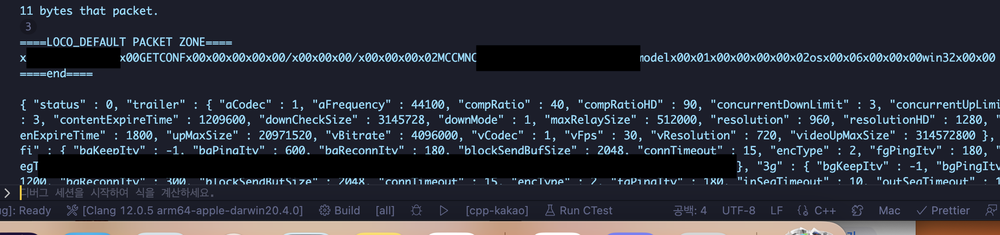

# loco-protocol-c

Loco protocol de/serializer written in C

**This project is under development.**

# Test

This project has been tested in the following environment:

Test Device: Apple Macbook Pro (M1)

- GCC 11.1.0 aarch64-apple-darwin32
- OpenSSL 1.1.1t (7 Feb 2023)
- macOS Ventura 13.3.1

- Receive data from "booking-loco.kakao.com" using the LOCO protocol (unencrypted packets)
- "kakao-impl-cpp(cpp-kakao)" is a LOCO protocol library that implements most of the features of KakaoTalk, currently under development and planned to be released by August 2023.

# To-Do

- [x] Loco Default(non-secure) Packet
- [ ] Loco Secure Packet
- [ ] Default SSL TCP Socket

# How to Build

To use the Loco protocol security layer features of this library, you need to install OpenSSL. (Handshake, Secure Packet, etc...)

# License

This project is under the MIT License.
For more information, see `LICENSE.md`
